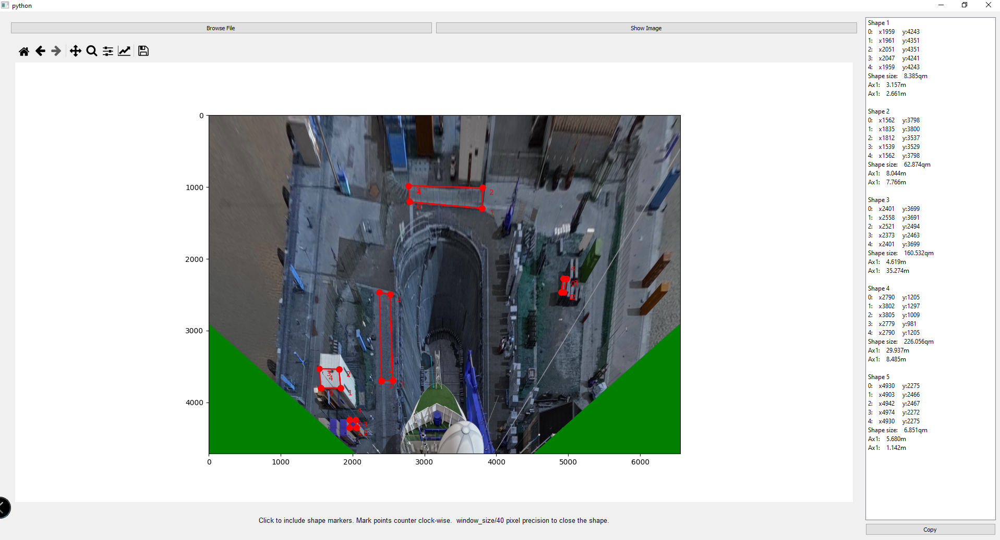

# Image_measure_landscape_interface

_GUI allowing the user to measure objects in a birdeye perspective image._

Class of GUI window allowing the user to load/show an image
upon which can mark points and close shapes.
The pixel coordinates are displayed on the right side in a panel.

The interface can also calculate and display the actual size of the measured object.
This works currently on a precision of <10% deviation in combination with [This Image Transform Project.](https://github.com/KonradSch98/GoPro_Image_Birdeye_Perspective_Transform_and_Undistort)

The measure function needs a .txt file in the image dir carrying the image_name in its filename
like 'G0010183_undist_size.txt' for the G0010183.jpg file.
with content lines eg:

0.0009342020206599135  
0.030559537531835428  
0.03056990046680869  

being the space size of a pixel, its x-size and y-size each in meter
So to say the space one pixel represents in real world.

### Example

